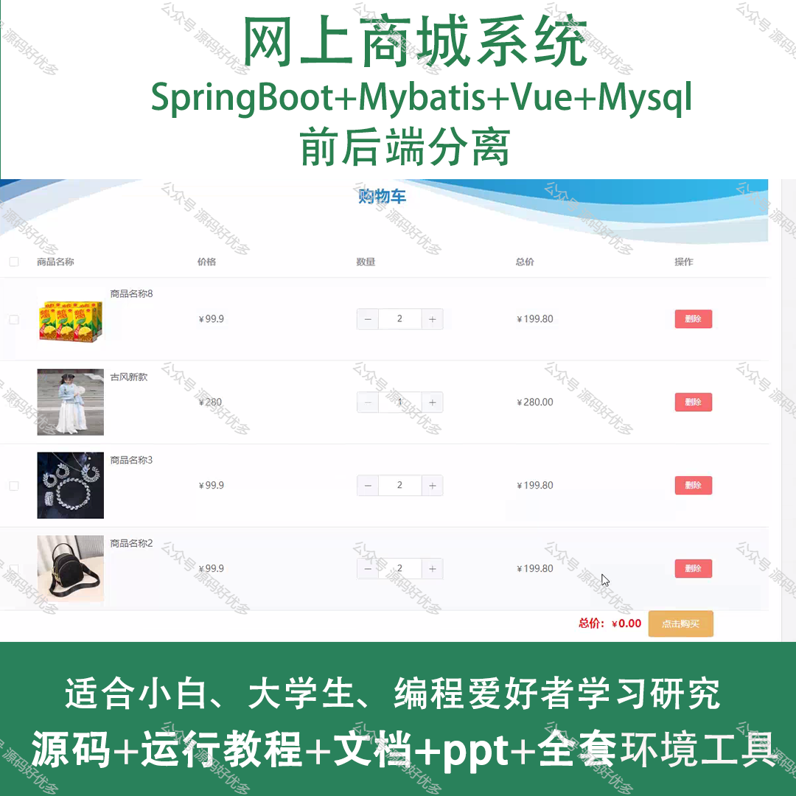
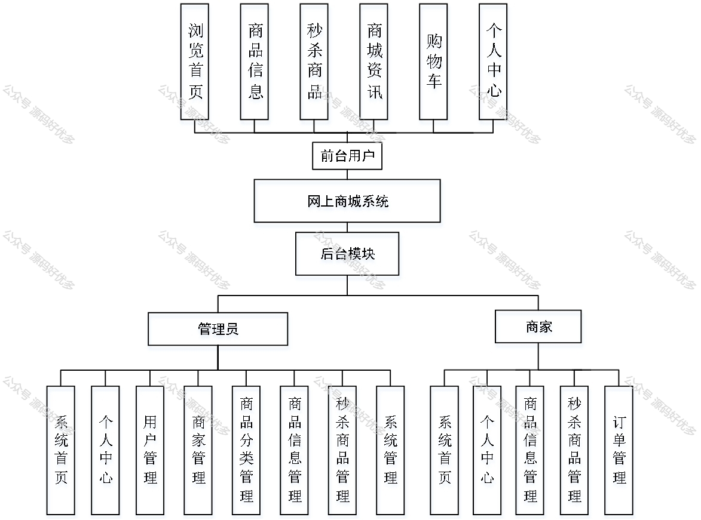
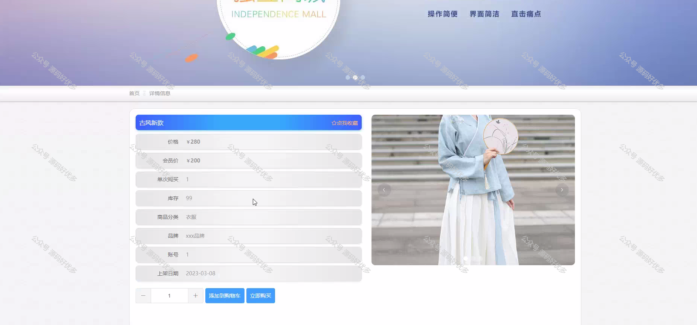
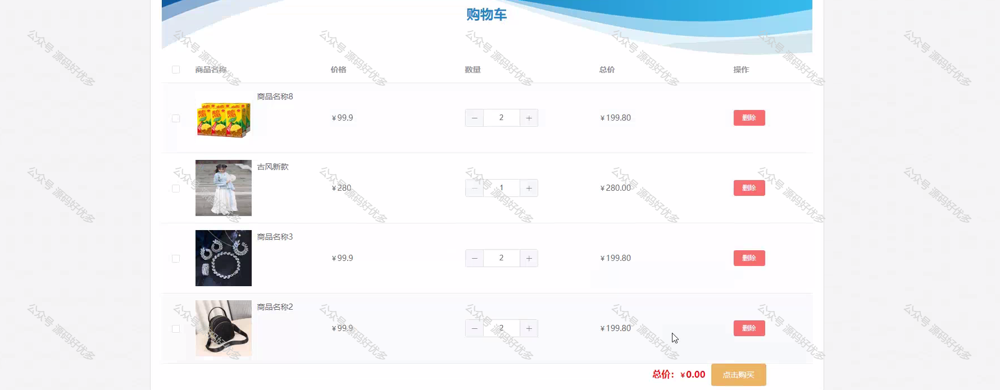
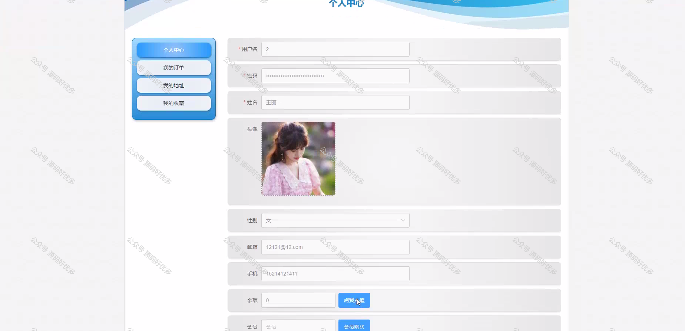
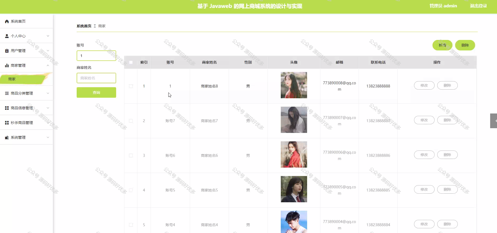
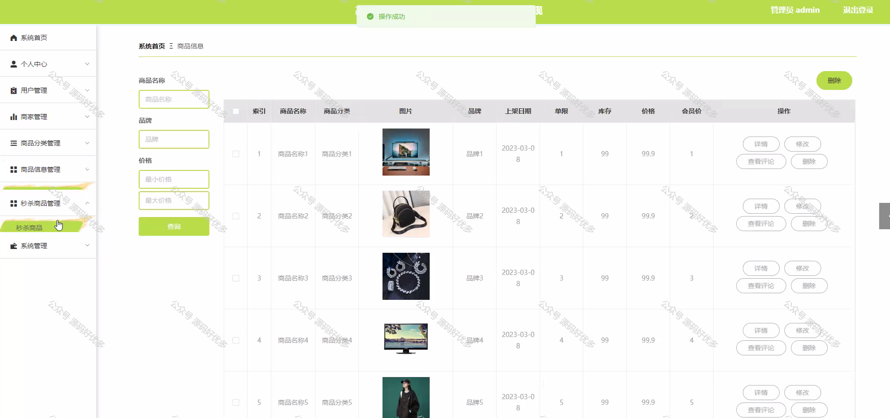
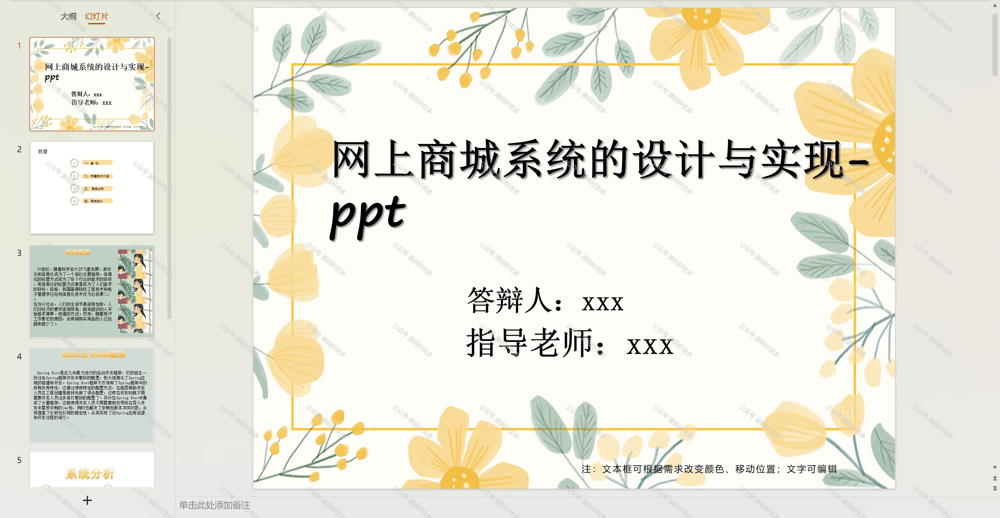
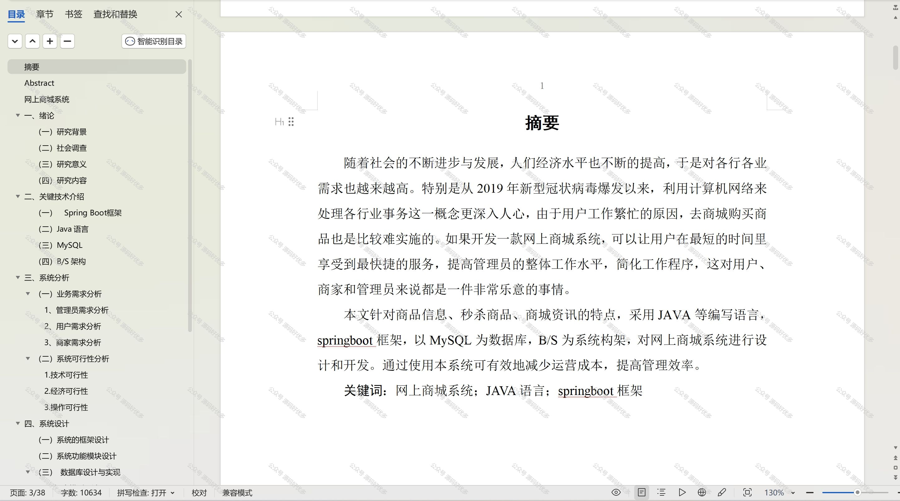

 
## 查看主页获取源码

### 一、作品包含

源码+数据库+设计文档万字+PPT+全套环境和工具资源+部署教程

### 二、项目技术

前端技术：Html、Css、Js、Vue、Element-ui

数据库：MySQL

后端技术：Java、Spring Boot、MyBatis

  

### 三、运行环境

开发工具：IDEA/eclipse

数据库：MySQL5.7

数据库管理工具：Navicat10以上版本

环境配置软件： JDK1.8+Maven3.6.3

前端Nodejs：14

### 四、项目介绍
项目编号：springbootA195

网上商城系统是在电子商务迅速发展的背景下诞生的一种新型商业运营模式，它通过互联网技术构建一个虚拟的购物环境，使得消费者可以不受时间和空间限制地浏览商品、下单购买、在线支付以及享受售后服务。随着网络技术的不断进步和消费者购物习惯的转变，网上商城系统不仅为企业提供了新的销售渠道和市场机遇，同时也极大地丰富了消费者的购物体验，推动了零售业的数字化转型。

前台用户功能：浏览首页、商品信息、秒杀商品、商城资讯、购物车、个人中心。

后台分为管理员和用户
管理员的功能：系统首页、个人中心、用户管理、商家管理、商品分类管理、商品信息管理、秒杀商品管理、系统管理。
用户的功能：系统首页、个人中心、商品信息管理、秒杀商品管理、订单管理。

### 五、运行截图

  
